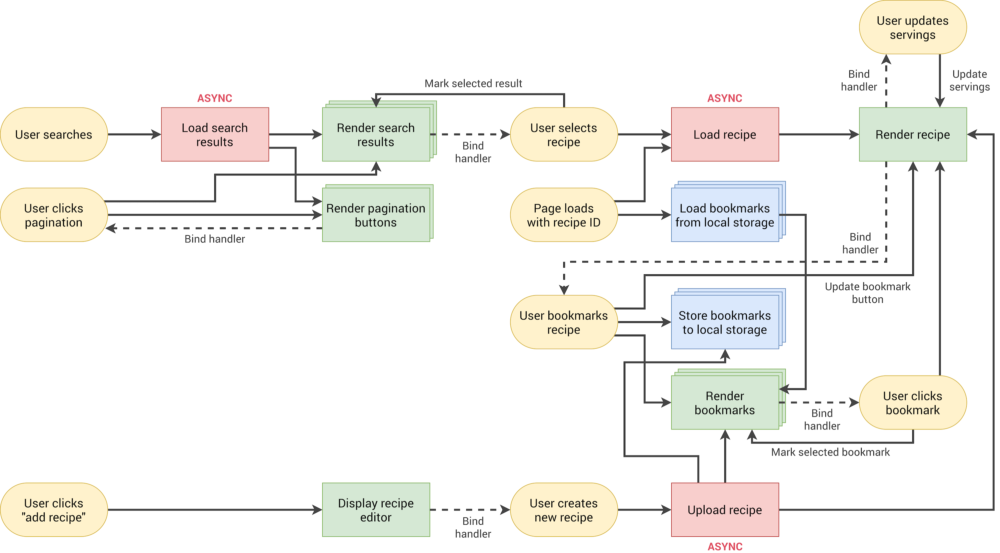

# Forkify App

## An app for recipe searching

In the app, one can search recipes based on a keyword, save a recipe in the bookmarks to view it later or add a personalized recipe. Each recipe displays the cooking time, number of servings and ingredients. The quantities change according to the number of servings chosen.

### Architecture

This app was built using the MVC architecture and following the schema below.

### Flowchart

The application was split into multiple parts. In the first place the simple scenarios were taken into consideration for the implementation of initial features. Afterwards, the more complex features were implemented over the base ones. In the end, all flows from the flowchart were covered.

### Implementation details

This application uses an [API](https://forkify-api.herokuapp.com/v2) that provides two functionalities: to get recipes and to create recipes. The GET request takes a search parameter which corresponds to the search input. When the user presses the search button, a list of recipes is fetched and rendered. The POST request takes recipe data and ingredients. When pressing the upload button, the recipe is posted and is visible to other users.

For the bookmark feature, local storage was used. When a user presses the bookmark button, the recipe is saved in the bookmarks section.

### Skills acquired

- Due to the MVC architecture, I learnt to split the code into multiple files and modules. To achieve this, I used classes that were exported and imported in/from other files.
- I followed the DRY principles by refactoring the code when it was being repeated more than 2-3 times.
- I strengthened my knowledge regarding promises and async await by using an API (through AJAX calls)
- Learned about catching and throwing errors (error handling)
- I used npm to install libraries. Some of the most important ones are:
  - Parcel - build tool I used as a dev enviroment but also production build
  - Regenerate Runtime - used for complining/transpiling async functions
  - Fractional - used to convert from decimals to fractions
